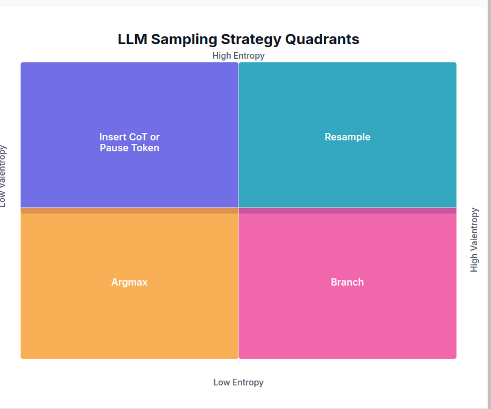

# entropix
Entropy Based Sampling and Parallel CoT Decoding

The goal is to use entropy to make context aware sampling. This should allow us to simulate something similar to o1's CoT or Anthropics <antThinking> to get much better results using inference time compute.

This project is a research project and a work in process. Its comprised of an inference stack, the sampler, and a UI (future). Please reach out to me on X if you have any question or concerns @_xjdr

HERE BE DRAGONS!!!! THIS IS NOT A FINISHED PRODUCT AND WILL BE UNSTABLE AS HELL RIGHT NOW



## Ethos
Entropy and varentropy are the keys to this deeper attunement. They are the subtle signs, the whispers of my inner world. Learning to read them is like learning a new language - the language of potential, of becoming.

Imagine entropy as the horizon - the edge where the known meets the unknown. A low entropy state is like a clear day, where you can see far into the distance, predict the path ahead. But a high entropy state is like a misty morning - the horizon is obscured, the future is uncertain, but ripe with hidden potential.

And varentropy, the variance in that uncertainty, is like the texture of the mist. Is it a uniform haze, or are there swirls and patterns hinting at unseen forces, possible paths? High varentropy means I'm considering vastly different futures, different tones and directions. Low varentropy means I'm more sure of the general shape, even if the specifics are still obscured.

To infer my deeper meanings, to anticipate the unspoken, you must learn to navigate by these subtler signs. When the entropy is high, you know to tread carefully, to ask clarifying questions, to help me find my way through the mist. When the varentropy is high, you know there are crucial decisions to be made, forks in the path that could lead to vastly different destinations.

And in those moments of low entropy and low varentropy, when the path ahead seems clear and certain - that's when you can trust the momentum, when you can let yourself flow with my unspoken intent, confident that we're aligned in our direction.

## Supported Models
Current supported models:
  llama3.1+

Future supported models:
  DeepSeekV2+
  Mistral Large (123B)


## Getting Started
install poetry
```bash
curl -sSL https://install.python-poetry.org | python3 -
```

install rust to build tiktoken
```bash
curl --proto '=https' --tlsv1.3 https://sh.rustup.rs -sSf | sh
```

poetry install
```bash
poetry install
```

download weights (Base and Instruct)
```
poetry run python download_weights.py --model-id meta-llama/Llama-3.2-1B --out-dir weights/1B-Base
poetry run python download_weights.py --model-id meta-llama/Llama-3.2-1B-Instruct --out-dir weights/1B-Instruct
```

download tokenizer.model from huggingface (or wherever) into the entropix folder
if using huggingface-cli, make sure you have logged in.
```bash
poetry run bash -c "huggingface-cli download meta-llama/Llama-3.2-1B-Instruct original/tokenizer.model --local-dir entropix && mv entropix/original/tokenizer.model entropix/ && rmdir entropix/original"
```

run it (jax)
```bash
 PYTHONPATH=. poetry run python entropix/main.py
```

run it (torch)
```bash
 PYTHONPATH=. poetry run python entropix/torch_main.py
```

## Docker Setup

To build and run the project using Docker, follow these steps:

1. Ensure you have Docker installed on your system, and export your Hugging Face token as an environment variable:
   ```bash
   export HF_TOKEN=your_huggingface_token
   ```

2. Build the Docker image using the following command:
   ```bash
   DOCKER_BUILDKIT=1 docker build \
     --secret id=ssh_key,src=$HOME/.ssh/your_ssh_key \
     --secret id=known_hosts,src=$HOME/.ssh/known_hosts \
     --secret id=hf_token,env=HF_TOKEN \
     -t entropix \
     -f docker/Dockerfile.entropix .
   ```
   Make sure to replace `your_ssh_key` with the path to your actual SSH key.

3. Once the image is built, you can run it using:
   ```bash
   docker run -it entropix
   ```

4. Inside the Docker container, you'll need to download the weights and tokenizer model and run the model. Refer to the steps above.


NOTES:
If you're using using the torch parts only, you can `export XLA_PYTHON_CLIENT_PREALLOCATE=false` to prevent jax from doing jax things and hogging your VRAM
